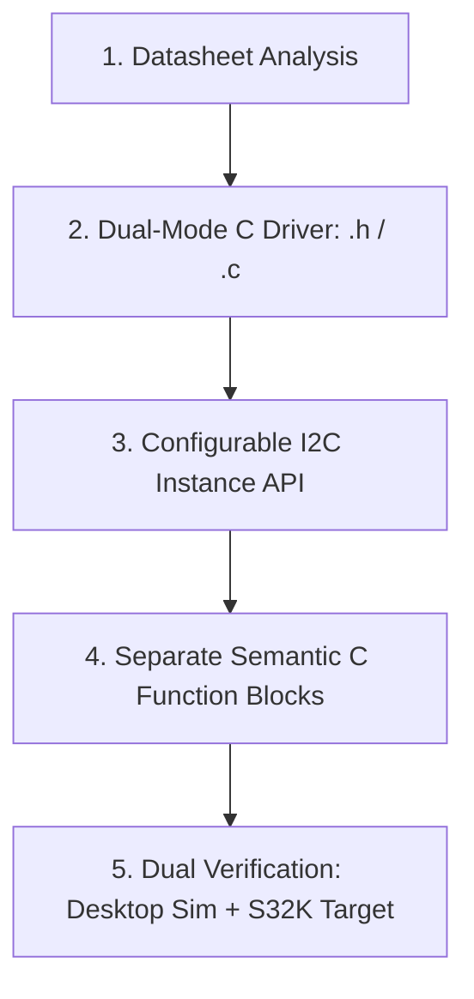

# Autonomous IC Driver & Model-Based Design (MBD) Guide
**Platform**: NXP S32K1xx (Cortex-M4) | MATLAB / Simulink (MBDT) | Embedded Coder

---

## Table of Contents
1. [Project Structure & Environment Initialization](#1-project-structure--environment-initialization)
2. [Quick Start: Testing Drivers in Desktop Simulation](#2-quick-start-testing-drivers-in-desktop-simulation)
   - [A. ST M24C04 EEPROM Demo](#a-st-m24c04-eeprom-demo)
   - [B. Maxim DS3231 RTC Demo (Separate Date & Time)](#b-maxim-ds3231-rtc-demo-separate-date--time)
   - [C. S32K144 Hardware Deployment & Wiring](#c-s32k144-hardware-deployment--wiring)
3. [The Universal Framework: From Datasheet to Simulink Model](#3-the-universal-framework-from-datasheet-to-simulink-model)
   - [Pillar 1: C Function Block instead of S-Function](#pillar-1-why-c-function-block-instead-of-s-function)
   - [Pillar 2: Clean Subsystem Architecture (No Redundant Enable Ports)](#pillar-2-clean-subsystem-architecture-no-redundant-enable-ports)
   - [Pillar 3: Dual-Mode Driver Architecture (PC Sim + S32K Target)](#pillar-3-dual-mode-driver-architecture)
   - [Pillar 4: Configurable Peripheral Instances (Bus Sharing & Multiplexing)](#pillar-4-configurable-peripheral-instances-bus-sharing--multiplexing)
   - [Pillar 5: User-Friendly Semantic Block Interfaces](#pillar-5-user-friendly-semantic-block-interfaces)
4. [Step-by-Step Agent Protocol for Any New IC](#4-step-by-step-agent-protocol-for-any-new-ic)
5. [Blueprints for Common Automotive & BMS ICs](#5-blueprints-for-common-automotive--bms-ics)
   - [Blueprint A: I2C-Based Real-Time Clock (RTC) - Maxim DS3231](#blueprint-a-i2c-based-real-time-clock-rtc---maxim-ds3231)
   - [Blueprint B: I2C-Based EEPROM - ST M24C04](#blueprint-b-i2c-based-eeprom---st-m24c04)
   - [Blueprint C: SPI-Based Smart Gate Driver](#blueprint-c-spi-based-smart-gate-driver)
   - [Blueprint D: SPI-Based SD Card / Memory Storage](#blueprint-d-spi-based-sd-card--memory-storage)
6. [Critical Checklist & Troubleshooting Rules](#6-critical-checklist--troubleshooting-rules)

---

## 1. Project Structure & Environment Initialization

The repository is organized following automotive Model-Based Design (MBD) modular standards:

```text
MultiCellBMS-Version3/
├── startup.m                   <- Automatically adds all subdirectories to the MATLAB path
├── .gitignore                  <- Filters temporary build artifacts and editor backups
│
├── drivers/                    <- Modular, dual-mode C drivers (.h and .c)
│   ├── eeprom_m24c04/          <- ST M24C04 EEPROM driver (m24c04.h, m24c04.c)
│   ├── rtc_ds3231/             <- Maxim DS3231 RTC driver (ds3231.h, ds3231.c)
│   └── sd_card_spi/            <- SPI SD Card Reader driver (sd_spi.h, sd_spi.c)
│
├── models/                     <- Simulink .slx models
│   ├── EEPROM_SmartWheels.slx  <- S32K144 hardware deployment model
│   ├── EEPROM_M24C04_Demo.slx  <- ST M24C04 simulation verification model
│   ├── RTC_DS3231_Demo.slx     <- Maxim DS3231 simulation verification model
│   └── SD_Card_SPI_Demo.slx    <- SPI SD Card simulation verification model
│
├── scripts/                    <- Automation scripts
│   ├── create_eeprom_blocks.m  <- Automates M24C04 block setup
│   ├── create_ds3231_blocks.m  <- Automates DS3231 block setup
│   ├── create_sd_blocks.m      <- Automates SD Card block setup
│   └── fix_eeprom_smartwheels.m<- Diagnostic repair script
│
└── docs/                       <- Technical documentation
    └── instruction.md          <- This guide
```

### Initializing the Environment in MATLAB
Open MATLAB and navigate to the project directory:
```matlab
cd('c:\Users\Shreyas\Documents\MultiCell BMS Algorithum Develpment LAB\MultiCellBMS-Version3');
startup;
```
`startup.m` automatically adds all driver, model, and script paths to your MATLAB search path.

---

## 2. Quick Start: Testing Drivers in Desktop Simulation

### A. ST M24C04 EEPROM Demo
1. Open the model:
   ```matlab
   open_system('EEPROM_M24C04_Demo');
   ```
2. Press **Run** (`Ctrl+T`).
3. **Verified Outputs**:
   - `Write_Status` displays `0` (Success).
   - `Read_Data_Display` displays the 32-byte payload: `[1, 2, 3, ..., 32]`.
   - `Read_Status` displays `0` (Success).
   - `M24C04_SetInstance` allows switching the I2C instance (`0` for `LPI2C0`, `1` for `LPI2C1`).

---

### B. Maxim DS3231 RTC Demo (Separate Date & Time)
1. Open the model:
   ```matlab
   open_system('RTC_DS3231_Demo');
   ```
2. Press **Run** (`Ctrl+T`).
3. **Verified Outputs**:
   - **Time Displays**: `Hours`, `Minutes`, and `Seconds` display live numbers that increment every step.
   - **Date Displays**: `Date`, `Month`, `Year_20xx`, and `DayOfWeek` display calendar date.
   - **Temperature**: `Die_Temperature_C` reads the internal TCXO temperature (`25.25` °C).
   - `RTC_SetI2CInstance` allows switching the I2C instance (`0` or `1`).

---

### C. SPI SD Card Reader Demo (BMS Trip & Blackbox Logging)
1. Open the model:
   ```matlab
   open_system('SD_Card_SPI_Demo');
   ```
2. Press **Run** (`Ctrl+T`).
3. **Verified Outputs**:
   - `Card_Type`: displays `8` (`SD_CARD_TYPE_SD2_HC` / High-Capacity SDHC card).
   - `Init_Status`: displays `0` (Success).
   - `Read_Status`: reads Sector 0 successfully (512-byte physical sector).
   - `Write_Status`: writes 512-byte test pattern to Sector 1.
   - `Payload_32B_Display`: reads 32-byte telemetry header from Sector 0 (`"MULTICELL_BMS_V3:TRIP_RECORDER_..."`).
   - `SD_SetInstance`: allows switching the LPSPI instance (`0` for `LPSPI0`, `1` for `LPSPI1`, `2` for `LPSPI2`).

---

### C. S32K144 Hardware Deployment & Wiring

When deploying to the NXP S32K144 EVB, both the ST M24C04 EEPROM and the Maxim DS3231 RTC can sit on the **same I2C bus** (`LPI2C0`) without conflict:

| Signal | S32K144 Pin | M24C04 EEPROM | DS3231 RTC | Pull-Up |
| :--- | :--- | :--- | :--- | :--- |
| **SDA** | `PTA2` | Pin 5 (SDA) | Pin 15 (SDA) | External 4.7 kΩ to 3.3V |
| **SCL** | `PTA3` | Pin 6 (SCL) | Pin 16 (SCL) | External 4.7 kΩ to 3.3V |
| **VCC** | 3.3V | Pin 8 (VCC) | Pin 2 (VCC) | Decoupling 0.1 µF to GND |
| **GND** | GND | Pins 1..4, 7 | Pins 5..13 (GND/NC) | Direct ground |
| **VBAT**| Battery / 3.0V | N/A | Pin 14 (VBAT) | CR2032 or tied to GND if unused |
| **Slave Addr** | — | `0x50` / `0x51` | `0x68` (Fixed) | **No address conflict!** |

1. Open `models/EEPROM_SmartWheels.slx`.
2. Press **Build Model** (`Ctrl+B`) with the `mbd_s32k.tlc` target.
3. Open serial monitor on OpenSDA (`115200` baud, 8-N-1) to view telemetry.

---

## 3. The Universal Framework: From Datasheet to Simulink Model

When an engineer or AI agent is tasked with creating a Simulink driver for a new peripheral IC (EEPROM, RTC, Gate Driver, AFE, IMU, SD Card), follow this **5-pillar design pattern**:



### Pillar 1: Why C Function Block instead of S-Function?
* **Always choose Simulink C Function Blocks** over legacy C MEX S-Functions or S-Function Builder.
* **Key Advantages**:
  1. **Zero TLC Overhead**: No brittle Target Language Compiler (`.tlc`) scripts.
  2. **Direct Array & Struct Support**: Directly accepts arrays (`uint8[32]`) and scalars (`uint8`, `single`) with clean SymbolSpec configurations.
  3. **Zero Binary Maintenance**: No `.mexw64` files to recompile across MATLAB versions.
  4. **Multi-Instantiation**: Always set `'CustomCodeIsMultiInstantiable', 'on'`.

---

### Pillar 2: Clean Subsystem Architecture (No Redundant `enable` Ports)
* In automotive Model-Based Design (AUTOSAR / ISO 26262), the block itself must **not** have an `enable` input port.
* Instead, place the C Function block inside an **Action Subsystem** (`If Action Subsystem`, `Function-Call Subsystem`, or `Enabled Subsystem`).
* The subsystem execution is controlled by the surrounding supervisor state machine.

---

### Pillar 3: Dual-Mode Driver Architecture
Every C driver must compile in two modes:
```c
#if defined(MATLAB_MEX_FILE) || defined(SIMULINK_SIM)
    /* ------------------------------------------------------------- */
    /* 1. PC Simulation Mode: Emulate register map in RAM            */
    /* ------------------------------------------------------------- */
    static uint8_t s_device_virtual_regs[REG_MAP_SIZE];
    /* Read/Write logic manipulates s_device_virtual_regs */
#else
    /* ------------------------------------------------------------- */
    /* 2. Embedded Target Mode: Call S32K SDK peripheral drivers     */
    /* ------------------------------------------------------------- */
    #include "lpi2c_driver.h"  /* or lpspi_driver.h / lpuart_driver.h */
    #include "osif.h"
    /* Calls LPI2C_DRV_MasterSendDataBlocking, etc. */
#endif
```

---

### Pillar 4: Configurable Peripheral Instances (Bus Sharing & Multiplexing)
Never hardcode peripheral instance numbers (e.g. `0U`) in driver C files. Provide both compile-time macros and dynamic runtime APIs:

```c
/* In <device>.h */
#ifndef DEVICE_DEFAULT_I2C_INSTANCE
#define DEVICE_DEFAULT_I2C_INSTANCE 0U
#endif

void     DEVICE_SetI2CInstance(uint32_t instance);
uint32_t DEVICE_GetI2CInstance(void);
```

In Simulink, expose a **`DEVICE_SetInstance`** block so the application model can switch between `LPI2C0`, `LPI2C1`, or `LPI2C2` at runtime without altering driver source code.

---

### Pillar 5: User-Friendly Semantic Block Interfaces
Avoid packing distinct physical signals into raw multi-byte arrays when they have different update rates or semantic meanings:
* **Time** (`Hours`, `Minutes`, `Seconds`) updates every second and is needed for high-rate event logging.
* **Date** (`Year`, `Month`, `Date`, `DayOfWeek`) changes once every 24 hours.
* Providing separate blocks (**`RTC_GetTime`** and **`RTC_GetDate`**) eliminates Demux blocks, prevents index confusion, and cuts I2C bus traffic in half (3-byte read vs 7-byte read).

---

## 4. Step-by-Step Agent Protocol for Any New IC

Whenever you give an agent a datasheet for an IC, the agent must execute these steps:

### Step 1: Datasheet Feature Extraction Checklist
1. **Communication Protocol**:
   - I2C: Max clock speed (100 kHz, 400 kHz, 1 MHz), 7-bit slave address(es), sub-addressing scheme.
   - SPI: Clock phase & polarity (`CPOL`, `CPHA`), Max SCLK frequency, CS active level, Word length (8, 16, 24-bit).
2. **Register Organization**:
   - Register address width (8-bit or 16-bit).
   - Auto-increment address pointer behavior and rollover boundaries.
3. **Hardware Boundaries & Timing**:
   - Burst limits / page write limits (e.g., 16-byte EEPROM page limit).
   - Required inter-byte delays or post-write cycle times ($t_W$).

---

### Step 2: Write the C Header (`<device>.h`)
Follow standard AUTOSAR return types and fixed array widths:
```c
#ifndef DEVICE_NAME_H
#define DEVICE_NAME_H

#include <stdint.h>
#include <stdbool.h>

#ifndef DEVICE_DEFAULT_I2C_INSTANCE
#define DEVICE_DEFAULT_I2C_INSTANCE 0U
#endif

typedef enum {
    DEVICE_STATUS_OK          = 0x00U,
    DEVICE_STATUS_ERROR       = 0x01U,
    DEVICE_STATUS_BUSY        = 0x02U,
    DEVICE_STATUS_PARAM_ERROR = 0x03U,
    DEVICE_STATUS_CRC_ERROR   = 0x04U
} device_status_t;

void     DEVICE_Init(void);
void     DEVICE_SetI2CInstance(uint32_t instance);
uint32_t DEVICE_GetI2CInstance(void);

#endif
```

---

### Step 3: Write the C Source (`<device>.c`)
- Guard desktop simulation with a virtual RAM/register array.
- For target hardware:
  - Guard against buffer overflows: validate `length` before any copy operation.
  - In read operations, **only clear up to `length`**: `memset(data, 0x00, length);` (never use `sizeof` or fixed max buffer size if the user buffer may be smaller!).
  - Use bounded blocking timeouts: `LPI2C_DRV_MasterSendDataBlocking(s_instance, ..., 25U)`.

---

### Step 4: Automate Simulink C Function Block Setup (`create_<device>_blocks.m`)
Use MATLAB automation scripts to generate the blocks with exact types:
```matlab
% Set block custom code
set_param(blk, 'CustomCodeSettingLocation', 'BlockSettings');
set_param(blk, 'CustomCodeIsMultiInstantiable', 'on');
set_param(blk, 'SimCustomHeaderFile', 'device.h');
set_param(blk, 'SimCustomSourceFile', 'device.c');
set_param(blk, 'CustomHeaderFile', 'device.h');
set_param(blk, 'CustomSourceFile', 'device.c');

% Setup SymbolSpec with explicit scalar/vector ports
spec = get_param(blk, 'SymbolSpec');
s_h = spec.addSymbol('hours');
s_h.Scope = 'Output'; s_h.Type = 'uint8'; s_h.Size = '1';
```

---

## 5. Blueprints for Common Automotive & BMS ICs

### Blueprint A: I2C-Based Real-Time Clock (RTC) - Maxim DS3231
*(Extremely Accurate I2C-Integrated RTC/TCXO/Crystal, Slave Address `0x68`)*

* **Bus**: I2C (Standard 100 kHz or Fast Mode 400 kHz, 7-bit Slave Address `0x68`).
* **Registers**:
  - `00h..02h`: Seconds, Minutes, Hours (24h format, BCD encoded).
  - `03h..06h`: Day of week (1..7), Date (1..31), Month/Century (1..12), Year (0..99, BCD encoded).
  - `0Eh`: Control Register (`EOSC`, `BBSQW`, `CONV`, `RS2`, `RS1`, `INTCN`, `A2IE`, `A1IE`).
  - `0Fh`: Status Register (`OSF` Oscillator Stop Flag, `EN32kHz`, `BSY`, `A2F`, `A1F`).
  - `11h..12h`: 10-bit Temperature Sensor (0.25°C resolution, signed two's complement).
* **Driver Architecture (`ds3231.h` / `ds3231.c`)**:
  - `DS3231_SetI2CInstance(uint32_t instance)`: Runtime selection of LPI2C instance.
  - `DS3231_GetTimeScalars(&h, &m, &s)`: Reads 3 bytes from register `0x00`.
  - `DS3231_SetTimeScalars(h, m, s)`: Writes 3 bytes to register `0x00`.
  - `DS3231_GetDateScalars(&y, &m, &d, &dow)`: Reads 4 bytes from register `0x03`.
  - `DS3231_SetDateScalars(y, m, d, dow)`: Writes 4 bytes to register `0x03`.
  - `DS3231_GetTemperature(&temp_c)`: Reads temperature in °C.
  - `DS3231_CheckOscillatorStopFlag(&osf, clear)`: Detects power loss/dead backup battery.
* **Simulink Block Interface (`models/RTC_DS3231_Demo.slx`)**:
  - `RTC_GetTime`: Outputs: `Hours` (uint8), `Minutes` (uint8), `Seconds` (uint8), `Status` (uint8).
  - `RTC_GetDate`: Outputs: `Date` (uint8), `Month` (uint8), `Year` (uint8), `DayOfWeek` (uint8), `Status` (uint8).
  - `RTC_SetTime`: Inputs: `Hours`, `Minutes`, `Seconds` $\rightarrow$ Output: `Status`.
  - `RTC_SetDate`: Inputs: `Date`, `Month`, `Year`, `DayOfWeek` $\rightarrow$ Output: `Status`.
  - `RTC_GetTemperature`: Outputs: `Die_Temperature_C` (single), `Status` (uint8).
  - `RTC_SetI2CInstance`: Input: `Instance` (uint32).

---

### Blueprint B: I2C-Based EEPROM - ST M24C04
*(4-Kbit I2C EEPROM, 2 Blocks x 256 Bytes, Page Size = 16 Bytes)*

* **Bus**: I2C (`0x50` for Block 0, `0x51` for Block 1).
* **Driver Architecture (`m24c04.h` / `m24c04.c`)**:
  - `M24C04_SetI2CInstance(uint32_t instance)`: Runtime selection of LPI2C instance.
  - `M24C04_Write(addr, data, len)`: Handles 16-byte physical page boundaries and 6 ms $t_W$ write delay.
  - `M24C04_Read(addr, data, len)`: Performs random-address sequential read.
  - `M24C04_ComputeCRC8(data, len)`: SAE J1850 CRC-8 checksum.
* **Simulink Block Interface (`models/EEPROM_M24C04_Demo.slx`)**:
  - `EEPROM_Write`: Inputs: `addr` (uint16), `data_in` (uint8[32]), `len` (uint16) $\rightarrow$ Output: `status` (uint8).
  - `EEPROM_Read`: Inputs: `addr` (uint16), `len` (uint16) $\rightarrow$ Outputs: `data_out` (uint8[32]), `status` (uint8).
  - `M24C04_SetInstance`: Input: `instance` (uint32).

---

### Blueprint C: SPI-Based Smart Gate Driver
*(e.g., TI DRV8305 / NXP GD3000 / ST L9908 for 3-Phase Inverters & BMS Contactor Drivers)*

* **Bus**: SPI (`LPSPI0` or `LPSPI1`).
* **SPI Format**: 16-bit word transfers (`CPOL=0, CPHA=1` or `CPOL=0, CPHA=0`).
  - Bit 15: Read (`1`) / Write (`0`).
  - Bits 14..11: Register Address (4 bits).
  - Bits 10..0: Data Payload (11 bits).
* **Driver Architecture**:
  ```c
  uint16_t GateDriver_ReadReg(uint8_t reg_addr);
  void     GateDriver_WriteReg(uint8_t reg_addr, uint16_t data);
  uint16_t GateDriver_ReadFaults(void);
  ```
* **Simulink Block Interface**:
  - `GateDriver_SetParam`: Inputs: `reg_addr` (uint8), `val` (uint16) $\rightarrow$ Output: `status` (uint8).
  - `GateDriver_GetStatus`: Outputs: `fault_word` (uint16), `status` (uint8).

---

### Blueprint D: SPI-Based SD Card / Memory Storage
*(e.g., SPI-Mode MicroSD/SDHC Card for BMS Blackbox Trip Logging & Crash Event Telemetry)*

* **Bus**: SPI (`LPSPI0`, `LPSPI1`, or `LPSPI2`), 8-bit transfers, SPI Mode 0 (`CPOL=0, CPHA=0`), 3.3V Logic.
  - Low speed during Card Identification ($\le 400\text{ kHz}$)
  - High speed during Data Transfer (up to $20\text{ MHz}$)
* **Sector Architecture**:
  - Standard physical sector size: **512 bytes per block**.
  - Standard SDSC cards use byte addresses (`sector * 512`), while SDHC/SDXC cards use direct sector index addresses (`sector`). The driver auto-detects this.
* **SPI Protocol & Command Framing**:
  - SD commands are 6 bytes: `[01b | 6-bit CMD] [32-bit Argument] [7-bit CRC | 1b]`.
  - `CMD0` (`0x40`, Arg `0x00000000`, CRC `0x95`): Software reset $\rightarrow$ Returns R1 `0x01` (In Idle State).
  - `CMD8` (`0x48`, Arg `0x000001AA`, CRC `0x87`): Send Interface Condition $\rightarrow$ Checks voltage range and echo pattern `0xAA`.
  - `CMD58` (`0x7A`, Arg `0x00000000`, CRC `0x01`): Read OCR register $\rightarrow$ Checks CCS (Card Capacity Status).
  - `CMD55` (`0x77`) + `ACMD41` (`0x69`, Arg `0x40000000`): Initialize card with High Capacity Support (HCS).
  - `CMD16` (`0x50`, Arg `0x00000200`): Force block size to 512 bytes (for standard SDSC).
  - `CMD17` (`0x51`, Arg `Sector`): Read Single Block $\rightarrow$ Wait for start token `0xFE`, read 512 bytes + 2-byte CRC.
  - `CMD24` (`0x58`, Arg `Sector`): Write Single Block $\rightarrow$ Send start token `0xFE` + 512 bytes + dummy CRC, poll busy bit.

* **S32K144 LPSPI Pinout Reference**:

| Signal | LPSPI0 (Recommended) | LPSPI1 | LPSPI2 | SD Card Pin / Function |
| :--- | :--- | :--- | :--- | :--- |
| **SCK** | `PTB2` (ALT3) or `PTE0` (ALT2) | `PTB14` (ALT3) | `PTC15` (ALT3) | CLK (Clock) |
| **MOSI** | `PTB4` (ALT3) or `PTE1` (ALT2) | `PTB16` (ALT3) | `PTC17` (ALT3) | DI (Data In) |
| **MISO** | `PTB3` (ALT3) or `PTE2` (ALT2) | `PTB15` (ALT3) | `PTC16` (ALT3) | DO (Data Out) |
| **CS (SS)** | `PTB5` (ALT3 / GPIO) | `PTB17` (ALT3 / GPIO) | `PTC14` (ALT3 / GPIO) | CS (Chip Select, Active LOW) |
| **VCC** | 3.3V Rail | 3.3V Rail | 3.3V Rail | Power (3.3V only, DO NOT use 5V) |
| **GND** | Board GND | Board GND | Board GND | Common Ground |

* **Driver Architecture (`drivers/sd_card_spi/sd_spi.h` & `sd_spi.c`)**:
  ```c
  void    SD_SPI_SetInstance(uint32_t instance);
  uint8_t SD_SPI_Init(uint8_t *card_type);
  uint8_t SD_SPI_ReadSector(uint32_t sector_num, uint8_t *data_512);
  uint8_t SD_SPI_WriteSector(uint32_t sector_num, const uint8_t *data_512);
  uint8_t SD_SPI_ReadPayload(uint32_t sector_num, uint16_t offset, uint8_t *payload, uint16_t len);
  uint8_t SD_SPI_WritePayload(uint32_t sector_num, uint16_t offset, const uint8_t *payload, uint16_t len);
  ```

* **Simulink Block Interface (`models/SD_Card_SPI_Demo.slx`)**:
  - `SD_Init`: Outputs: `card_type` (uint8: `0x01`=MMC, `0x02`=SDv1, `0x04`=SDv2-SC, `0x0C`=SDv2-HC), `status` (uint8: `0`=OK).
  - `SD_ReadSector`: Input: `sector_id` (uint32) $\rightarrow$ Outputs: `data_512` (uint8[512]), `status` (uint8).
  - `SD_WriteSector`: Inputs: `sector_id` (uint32), `data_512` (uint8[512]) $\rightarrow$ Output: `status` (uint8).
  - `SD_ReadPayload`: Inputs: `sector_id` (uint32), `offset` (uint16), `length` (uint16) $\rightarrow$ Outputs: `payload_32` (uint8[32]), `status` (uint8).
  - `SD_SetInstance`: Input: `instance` (uint32: `0`=LPSPI0, `1`=LPSPI1, `2`=LPSPI2).

* **Dual-Mode Operation**:
  - **Desktop / Host Simulation**: Uses an in-RAM virtual disk (8 sectors $\times$ 512 bytes) pre-initialized with formatted BMS telemetry magic header (`"BMS-LOG-v3.0"`), letting you verify your algorithm, block parsing, and state flow directly in Simulink without hardware.
  - **Hardware Target**: Transparently switches to S32K SDK `LPSPI_DRV_MasterTransferBlocking()` and GPIO chip select controls when compiled with S32 Design Studio / Embedded Coder.

---

## 6. Critical Checklist & Troubleshooting Rules

| Error / Symptom | Root Cause | Solution |
| :--- | :--- | :--- |
| **Transmitting `0x00` instead of data** | Inverted wiring on C Function block: Port 1 is the function return value (`status`), while Port 2 is the data pointer (`data_out`). | Wire Port 2 (`data_out`) to your transmitter and Port 1 (`status`) to a Terminator or error handler. |
| **Memory corruption / erratic variable values** | `memset(data, 0x00, M24C04_MAX_BUFFER_SIZE)` executed when `data` buffer was allocated with smaller size (e.g. 2 bytes). | Always zero only the requested `length`: `memset(data, 0x00, length);`. |
| **Reading stale / blank memory on first cycle** | Execution scheduling inversion: Read block placed at root model executes *before* Write block inside Action Subsystem. | Sequence operations using state flags, enabled subsystems, or Stateflow so Write finishes before Read executes. |
| **Bus flooding & LPUART dropped bytes** | Read/Transmit blocks placed in root model run unconditionally on every timer interrupt (e.g. every 200 ms). | Guard read/transmit blocks with one-shot triggers or state machine conditions. |
| `'CustomCodeIsMultiInstantiable' is set to 'off'` | Multiple C Function blocks reference the same `.h`/`.c` file. | Run `set_param(blk, 'CustomCodeIsMultiInstantiable', 'on')` on all C Function blocks. |
| `function declared implicitly` | `SimCustomHeaderFile` was left empty on the C Function block. | Set `SimCustomHeaderFile = '<device>.h'` and `CustomHeaderFile = '<device>.h'` on the block. |
| `Data type mismatch: expects 'boolean', driven by 'double'` | Simulink Pulse Generator or Constant outputs `double` by default. | Insert a **Data Type Conversion** block set to `boolean` (or `uint8`). |
| EEPROM Data Rollover | Writing an array across physical page boundaries (e.g. 16-byte boundary). | Driver must split array into chunks: `chunk = 16 - (addr & 15)` before sending I2C STOP. |
| HardFault during I2C/SPI transfer | Peripheral clock was not enabled or GPIO pins were unconfigured. | Ensure NXP `Config` block (`LPI2C_Config`, `LPSPI_Config`) is present and initializes clocks (`PCC`). |
