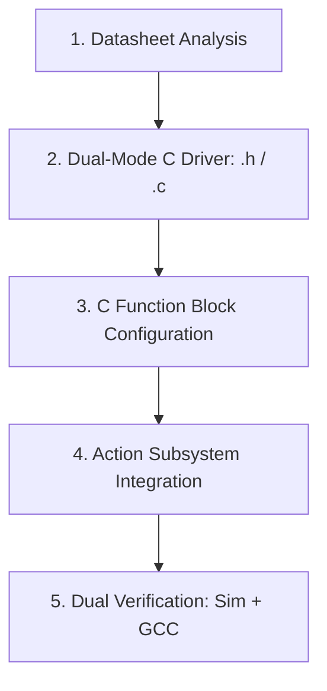

# Autonomous IC Driver & Model-Based Design (MBD) Guide
**Platform**: NXP S32K1xx (Cortex-M4) | MATLAB / Simulink (MBDT) | Embedded Coder

---

## Table of Contents
1. [Quick Start: Testing the ST M24C04 EEPROM Driver](#1-quick-start-testing-the-st-m24c04-eeprom-driver)
2. [The Universal Framework: From Datasheet to Simulink Model](#2-the-universal-framework-from-datasheet-to-simulink-model)
3. [Step-by-Step Agent Protocol for Any New IC](#3-step-by-step-agent-protocol-for-any-new-ic)
4. [Blueprints for Common Automotive & BMS ICs](#4-blueprints-for-common-automotive--bms-ics)
   - [Blueprint A: I2C-Based Real-Time Clock (RTC)](#blueprint-a-i2c-based-real-time-clock-rtc)
   - [Blueprint B: SPI-Based Smart Gate Driver](#blueprint-b-spi-based-smart-gate-driver)
   - [Blueprint C: SPI-Based SD Card / Memory Storage](#blueprint-c-spi-based-sd-card--memory-storage)
5. [Critical Checklist & Troubleshooting Rules](#5-critical-checklist--troubleshooting-rules)

---

## 1. Quick Start: Testing the ST M24C04 EEPROM Driver

### A. Desktop Simulation (No Hardware Required)
1. Open MATLAB and navigate to the project directory:
   ```matlab
   cd('c:\Users\Shreyas\Documents\MultiCell BMS Algorithum Develpment LAB\MultiCellBMS-Version3');
   ```
2. Open the verification demo model:
   ```matlab
   open_system('EEPROM_M24C04_Demo');
   ```
3. Press **Run** (or `Ctrl+T`).
4. **Expected Result**:
   - `Write_Status` displays `0` (Success).
   - `Read_Data_Display` displays the 32-byte vector `[1, 2, 3, ..., 32]`.
   - `Read_Status` displays `0` (Success).

---

### B. Hardware Execution on NXP S32K144
1. Open [`EEPROM_SmartWheels.slx`](file:///c:/Users/Shreyas/Documents/MultiCell%20BMS%20Algorithum%20Develpment%20LAB/MultiCellBMS-Version3/EEPROM_SmartWheels.slx).
2. Ensure hardware connections on your board:
   - **SCL**: `PTA3` (LPI2C0_SCL) with external 4.7 kΩ pull-up to 3.3V.
   - **SDA**: `PTA2` (LPI2C0_SDA) with external 4.7 kΩ pull-up to 3.3V.
   - **E1, E2, WC**: Tied to GND (Write Protect disabled, base address `0x50`).
3. Press **Build Model** (`Ctrl+B`) using the `mbd_s32k.tlc` target.
4. Open your serial terminal (PuTTY, Tera Term, or SerialPlot) on the OpenSDA COM port:
   - **Baud Rate**: `115200`
   - **Data Bits**: 8, **Parity**: None, **Stop Bits**: 1
5. Trigger write/read to inspect serial telemetry.

---

## 2. The Universal Framework: From Datasheet to Simulink Model

When an engineer or AI agent is tasked with creating a Simulink driver for a new peripheral IC (EEPROM, RTC, Gate Driver, AFE, IMU, SD Card), follow this **5-pillar design pattern**:



### Pillar 1: Why C Function Block instead of S-Function?
* **Always choose Simulink C Function Blocks** over legacy C MEX S-Functions or S-Function Builder.
* **Reasons**:
  1. **No TLC Overhead**: Avoids writing brittle Target Language Compiler (`.tlc`) scripts.
  2. **Direct Array Support**: Directly accepts and outputs 1D fixed arrays (`uint8[32]`) without pointer indexing macros (`ssGetInputPortRealSignalPtrs`).
  3. **Zero Binary Maintenance**: No `.mexw64` files to recompile across MATLAB versions.
  4. **Multi-Instantiation**: Must always set `'CustomCodeIsMultiInstantiable', 'on'`.

---

### Pillar 2: Clean Subsystem Architecture (No Redundant `enable` Ports)
* In automotive Model-Based Design (AUTOSAR / ISO 26262), the block itself must **not** have an `enable` input port.
* Instead, place the C Function block inside an **Action Subsystem** (`If Action Subsystem`, `Function-Call Subsystem`, or `Enabled Subsystem`).
* The subsystem execution is controlled by the surrounding supervisor state machine.

---

### Pillar 3: Dual-Mode Driver Architecture
Every C driver must compile in two modes:
```c
#if defined(MATLAB_MEX_FILE) || defined(SIMULINK_SIM)
    /* ------------------------------------------------------------- */
    /* 1. PC Simulation Mode: Emulate register map in RAM            */
    /* ------------------------------------------------------------- */
    static uint8_t s_device_virtual_regs[REG_MAP_SIZE];
    /* Read/Write logic manipulates s_device_virtual_regs */
#else
    /* ------------------------------------------------------------- */
    /* 2. Embedded Target Mode: Call S32K SDK peripheral drivers     */
    /* ------------------------------------------------------------- */
    #include "lpi2c_driver.h"  /* or lpspi_driver.h / lpuart_driver.h */
    #include "osif.h"
    /* Calls LPI2C_DRV_MasterSendDataBlocking, LPSPI_DRV_MasterTransferBlocking, etc. */
#endif
```

---

## 3. Step-by-Step Agent Protocol for Any New IC

Whenever you give an agent a datasheet for an IC, the agent must execute these steps:

### Step 1: Datasheet Feature Extraction Checklist
Extract the following exact parameters from the IC datasheet:
1. **Communication Protocol**:
   - I2C: Max clock speed (100 kHz, 400 kHz, 1 MHz), 7-bit slave address(es), sub-addressing scheme.
   - SPI: Clock phase & polarity (`CPOL`, `CPHA`), Max SCLK frequency, CS active level (typically low), Word length (8-bit, 16-bit, 24-bit).
2. **Register Organization**:
   - Register address width (8-bit or 16-bit).
   - Read/Write bit position (e.g. MSB = 1 for Write, 0 for Read; or separate R/W command byte).
3. **Hardware Boundaries & Timing**:
   - Burst limits / FIFO depths / page size limits (e.g., 16-byte EEPROM page limit, 4-byte SPI FIFO).
   - Required inter-byte delays or post-write cycle times ($t_W$).

---

### Step 2: Write the C Header (`<device>.h`)
Follow standard AUTOSAR return types and fixed array widths:
```c
#ifndef DEVICE_NAME_H
#define DEVICE_NAME_H

#include <stdint.h>
#include <stdbool.h>

#define DEVICE_BUFFER_SIZE  32U

typedef enum {
    DEVICE_STATUS_OK          = 0x00U,
    DEVICE_STATUS_ERROR       = 0x01U,
    DEVICE_STATUS_BUSY        = 0x02U,
    DEVICE_STATUS_PARAM_ERROR = 0x03U,
    DEVICE_STATUS_CRC_ERROR   = 0x04U
} device_status_t;

void    DEVICE_Init(void);
void    DEVICE_SetI2CInstance(uint32_t instance);
uint32_t DEVICE_GetI2CInstance(void);
uint8_t DEVICE_Write(uint16_t reg_addr, const uint8_t *data, uint16_t length);
uint8_t DEVICE_Read(uint16_t reg_addr, uint8_t *data, uint16_t length);
uint8_t DEVICE_ComputeCRC8(const uint8_t *data, uint16_t length);

#endif
```

---

### Step 3: Write the C Source (`<device>.c`)
- Guard desktop simulation with a virtual RAM/register array.
- For target hardware:
  - Guard against buffer overflows: `if (length > DEVICE_BUFFER_SIZE) return DEVICE_STATUS_PARAM_ERROR;`
  - In read operations, **zero-pad** unused buffer bytes: `memset(data, 0x00, DEVICE_BUFFER_SIZE);`
  - Use bounded blocking timeouts: `LPI2C_DRV_MasterSendDataBlocking(..., 25U)` or `LPSPI_DRV_MasterTransferBlocking(..., 25U)`.

---

### Step 4: Automate Simulink C Function Block Setup (`create_<device>_blocks.m`)
Use MATLAB automation scripts to generate the blocks with exact types:
```matlab
% Set block custom code
set_param(blk, 'CustomCodeSettingLocation', 'BlockSettings');
set_param(blk, 'CustomCodeIsMultiInstantiable', 'on');
set_param(blk, 'SimCustomHeaderFile', 'device.h');
set_param(blk, 'SimCustomSourceFile', 'device.c');
set_param(blk, 'CustomHeaderFile', 'device.h');
set_param(blk, 'CustomSourceFile', 'device.c');

% Setup SymbolSpec
spec = get_param(blk, 'SymbolSpec');
s_addr = spec.addSymbol('addr');
s_addr.Scope = 'Input'; s_addr.Type = 'uint16'; s_addr.Size = '1';

s_data = spec.addSymbol('data_in');
s_data.Scope = 'Input'; s_data.Type = 'uint8'; s_data.Size = '32';

s_len = spec.addSymbol('len');
s_len.Scope = 'Input'; s_len.Type = 'uint16'; s_len.Size = '1';

s_stat = spec.addSymbol('status');
s_stat.Scope = 'Output'; s_stat.Type = 'uint8'; s_stat.Size = '1';

set_param(blk, 'OutputCode', 'status = DEVICE_Write(addr, data_in, len);');
```

---

## 4. Blueprints for Common Automotive & BMS ICs

### Blueprint A: I2C-Based Real-Time Clock (RTC) - Maxim DS3231
*(Extremely Accurate I2C-Integrated RTC/TCXO/Crystal, Slave Address `0x68`)*

* **Bus**: I2C (Standard 100 kHz or Fast Mode 400 kHz, 7-bit Slave Address `0x68`).
* **Registers**:
  - `00h..06h`: Seconds, Minutes, Hours (24h), Day of week (1..7), Date (1..31), Month/Century (1..12), Year (0..99) in **BCD**.
  - `0Eh`: Control Register (`EOSC`, `BBSQW`, `CONV`, `RS2`, `RS1`, `INTCN`, `A2IE`, `A1IE`).
  - `0Fh`: Status Register (`OSF` Oscillator Stop Flag, `EN32kHz`, `BSY`, `A2F`, `A1F`).
  - `11h..12h`: 10-bit Temperature Sensor (0.25°C resolution, signed two's complement).
* **Driver Architecture (`ds3231.h` / `ds3231.c`)**:
  - `DS3231_SetI2CInstance(uint32_t instance)`: Runtime selection of LPI2C instance (LPI2C0, LPI2C1, etc.).
  - `DS3231_SetTimeArray(const uint8_t *time_vec)`: Writes 7-element vector `[Year, Month, Date, Day, Hour, Min, Sec]`.
  - `DS3231_GetTimeArray(uint8_t *time_vec)`: Reads 7-element vector `[Year, Month, Date, Day, Hour, Min, Sec]`.
  - `DS3231_GetTemperature(float *temp_c)`: Reads temperature in °C.
  - `DS3231_CheckOscillatorStopFlag(bool *osf, bool clear)`: Checks battery status / time validity.
* **Simulink Block Interface (`RTC_DS3231_Demo.slx`)**:
  - `DS3231_GetTime`: Outputs: `time_out` (uint8[7]), `status` (uint8).
  - `DS3231_SetTime`: Inputs: `time_in` (uint8[7]) $\rightarrow$ Output: `status` (uint8).
  - `DS3231_GetTemp`: Outputs: `temp_c` (single), `status` (uint8).
  - `DS3231_SetInstance`: Input: `instance` (uint32).

---

### Blueprint B: SPI-Based Smart Gate Driver
*(e.g., TI DRV8305 / NXP GD3000 / ST L9908 for 3-Phase Inverters & BMS Contactor Drivers)*

* **Bus**: SPI (`LPSPI0` or `LPSPI1`).
* **SPI Format**: 16-bit word transfers (`CPOL=0, CPHA=1` or `CPOL=0, CPHA=0`).
  - Bit 15: Read (`1`) / Write (`0`).
  - Bits 14..11: Register Address (4 bits).
  - Bits 10..0: Data Payload (11 bits).
* **Driver Architecture**:
  ```c
  uint16_t GateDriver_ReadReg(uint8_t reg_addr);
  void     GateDriver_WriteReg(uint8_t reg_addr, uint16_t data);
  uint16_t GateDriver_ReadFaults(void);
  ```
  - Calls `LPSPI_DRV_MasterTransferBlocking(0U, tx_buf, rx_buf, 1U, timeout);`
* **Simulink Block Interface**:
  - `GateDriver_SetParam`: Inputs: `reg_addr` (uint8), `val` (uint16) $\rightarrow$ Output: `status` (uint8).
  - `GateDriver_GetStatus`: Outputs: `fault_word` (uint16), `status` (uint8).

---

### Blueprint C: SPI-Based SD Card / Memory Storage
*(e.g., SPI-Mode MMC/SD Card for BMS Blackbox Trip Logging)*

* **Bus**: SPI (`LPSPI`), 8-bit transfers, low speed (400 kHz) for init, high speed (up to 20 MHz) for data.
* **Protocol**: CMD framing (6 bytes: `[0x40 | cmd, arg_3, arg_2, arg_1, arg_0, crc7 | 0x01]`).
* **Sector Size**: Fixed 512 bytes per block (`CMD17` Read Single Block, `CMD24` Write Single Block).
* **Driver Architecture**:
  - `SD_Init()`: Sends 80 dummy clock cycles with CS high, issues `CMD0` (Software Reset), `CMD8`, `ACMD41` until ready.
  - `SD_WriteSector(uint32_t sector_num, const uint8_t *sector_512b)`.
  - `SD_ReadSector(uint32_t sector_num, uint8_t *sector_512b)`.
* **Simulink Block Interface**:
  - `SD_WriteBlock`: Inputs: `sector_id` (uint32), `data_512` (uint8[512]) $\rightarrow$ Output: `status` (uint8).
  - `SD_ReadBlock`: Inputs: `sector_id` (uint32) $\rightarrow$ Outputs: `data_512` (uint8[512]), `status` (uint8).

---

## 5. Critical Checklist & Troubleshooting Rules

| Error / Symptom | Root Cause | Solution |
| :--- | :--- | :--- |
| `'CustomCodeIsMultiInstantiable' is set to 'off'` | Multiple C Function blocks in the model reference the same `.h`/`.c` file. | Run `set_param(blk, 'CustomCodeIsMultiInstantiable', 'on')` on all C Function blocks. |
| `function declared implicitly` | `SimCustomHeaderFile` was left empty on the C Function block. | Set `SimCustomHeaderFile = '<device>.h'` and `CustomHeaderFile = '<device>.h'` on the block. |
| `Data type mismatch: expects 'boolean', driven by 'double'` | Simulink Pulse Generator outputs `double` by default. | Insert a **Data Type Conversion** block set to `boolean` before boolean inputs. |
| EEPROM / Memory Data Rollover | Writing an array across physical page boundaries (e.g. 16-byte boundary). | Driver must split array into chunks: `chunk = 16 - (addr & 15)` before sending I2C STOP. |
| HardFault during I2C/SPI transfer | Peripheral clock was not enabled or GPIO pins were unconfigured. | Ensure NXP `Config` block (`LPI2C_Config`, `LPSPI_Config`) is present and initializes clocks (`PCC`). |
| Missing `.tlc` or target compiler errors | Using S-Function Builder instead of C Function block. | Replace with native Simulink C Function block. No TLC script needed. |
